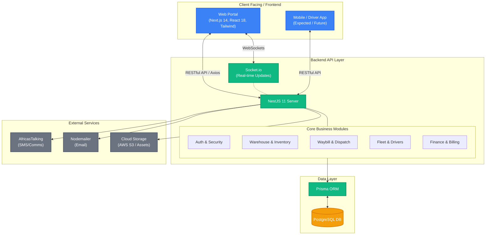

# Zito Logistics Platform - Architecture and Code State Report

## 1. Executive Summary

This document provides a high-level overview of the architecture and current state of the Zito Logistics Platform codebase. Based on a comprehensive technical analysis, the platform is built on a highly modern, scalable, and enterprise-grade technology stack. 

Despite existing technical debt or messy implementations in certain modules, **the codebase is fundamentally sound, fully compiles, and does not require a complete rewrite.** It contains roughly 99,000 lines of code, representing a massive investment of business logic that is actively functioning.

---

## 2. Technology Stack Overview

The project is divided into two primary environments, utilizing the most current and robust frameworks available in the TypeScript ecosystem.

### Frontend Architecture
*   **Framework:** Next.js 14 (React 18)
*   **Styling:** Tailwind CSS
*   **State Management / Data Fetching:** React Query (`@tanstack/react-query`), Zustand
*   **Forms & Validation:** React Hook Form (`react-hook-form`) + Zod
*   **UI Components:** Radix UI / Headless UI patterns (inferred from common Tailwind usage), Lucide React (Icons)
*   **Mapping:** Google Maps API (`@react-google-maps/api`)
*   **Real-time:** Socket.io Client

### Backend Architecture
*   **Framework:** NestJS 11 (Highly modular, enterprise Node.js framework)
*   **Database:** PostgreSQL
*   **ORM:** Prisma (`@prisma/client` v5.22.0)
*   **Real-time:** Socket.io (`@nestjs/websockets`)
*   **Security:** Passport JWT authentication, Helmet, Express Rate Limiter, Bcrypt
*   **Integrations:** AfricasTalking (SMS/Comms), Nodemailer (Emails), AWS S3 / File processing.

---

## 3. Current State of the Codebase

### Code Volume & Build Health
*   **Size:** ~99,105 lines of TypeScript/TSX code.
*   **Frontend Build:** Compiles successfully without fatal errors.
*   **Backend Build:** Compiles successfully without fatal errors (`nest build` exits with code 0).

### Known Issues & Technical Debt
1.  **Test Environment Errors (`compile-errors.txt`):** The backend contains test-runner errors in the `.spec.ts` files (e.g., `describe` and `it` being undefined). This is **not** a flaw in the business logic; it is simply a missing development dependency (`@types/jest`).
2.  **Implementation Quality:** As noted in the `COMPREHENSIVE_AUDIT_REPORT.md`, certain business logic flows (like Driver Shift restrictions or complex rate calculations) may be implemented poorly, bypass safety checks, or lack proper service-layer abstraction.
3.  **Module Coupling:** With a codebase of this size, there are likely areas where domain boundaries are crossed, making it hard to modify one feature without impacting another.

---

## 4. Architectural Strengths (Why the code is "Good")

1.  **Type Safety (TypeScript):** Having end-to-end TypeScript from the database (Prisma) to the backend (NestJS) to the frontend (Next.js) prevents entire classes of runtime bugs.
2.  **NestJS Modularity:** The backend is built using NestJS, which inherently enforces a strict architecture of Modules, Controllers, and Services. This means fixing "bad code" is as simple as isolating a specific Service (e.g., `WarehouseService`) and rewriting just that file.
3.  **Next.js SSR/SSG:** The frontend is utilizing a modern React framework capable of server-side rendering, which is excellent for performance and SEO.

---

## 5. Recommended Refactoring Strategy

Do not rewrite the project. Instead, execute an **Incremental Refactoring Strategy (Strangler Fig Pattern)**:

1.  **Immediate Fix:** Run `npm install --save-dev @types/jest` in the backend to clear the noisy compile errors in the test files.
2.  **Strict Linting:** Enforce ESLint and Prettier rules in CI/CD. Do not let *new* bad code merge, while slowly fixing *old* bad code.
3.  **Module Isolation:** Identify the top 3 most painful or buggy modules (e.g., Waybill generation, Dispatch logic). Isolate these NestJS modules and refactor them individually. Because NestJS is deeply decoupled, you can completely gut and rewrite `DispatchService` without breaking the `FinanceService`.
4.  **Enhance Unit Testing:** Before refactoring a "bad" module, write unit tests against its current behavior. Then, refactor the code and ensure the tests still pass. This guarantees you won't introduce regressions.

---

## 6. High-Level Block Diagram

Here is a simplified visual representation of how the components in the Zito Logistics Platform interact with each other:

