# Zito Business Process Flow

**Source PRD:** `docs/prd/ZITO_PRD_v10_ULTIMATE.txt`  
**Purpose:** Business-facing view of how Zito workflows operate across customers, partners, warehouses, finance, and internal operations.

## 1. Business Model

Zito is a logistics orchestration platform. It connects demand and supply without owning trucks, warehouses, or drivers.

Revenue sources:

- Platform commission per booking.
- B2B subscriptions for transporters, courier companies, warehouses, and corporate shippers.
- Value-added services such as routing, analytics, support, compliance, and finance workflows.

Primary marketplace loop:

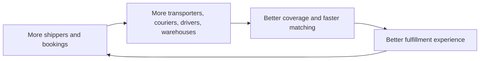

## 2. User Groups

| Group | Business Role |
|---|---|
| Individual Customer | Books courier, PTL, FTL, warehouse, and urgent services |
| Corporate Shipper | Manages recurring shipments, billing, invoices, multiple addresses |
| Driver | Executes trips, pickup, transit, delivery, proof, earnings |
| Agent | Sources loads/capacity and earns commission |
| Transporter | Supplies vehicles, drivers, dispatch capacity |
| Courier Company | Handles last-mile pickup/delivery operations |
| Warehouse Partner | Receives, stores, scans, picks, packs, dispatches goods |
| Internal Operations | Controls bookings, exceptions, support, compliance |
| Accounts Staff | Handles invoices, payments, refunds, reconciliation |
| Admin/Super Admin | Governance, provisioning, approvals, platform controls |

## 3. Customer Booking Flow

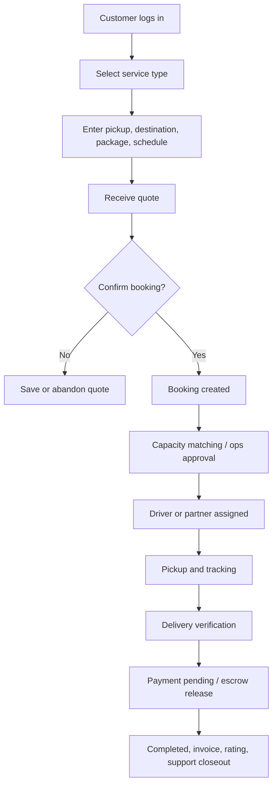

## 4. Booking Operations Flow

| Stage | Owner | Business Decision |
|---|---|---|
| Created | Customer/corporate | Booking details are captured |
| Searching | System/ops | Find capacity and validate serviceability |
| Approved | Operations | Booking can enter assignment/marketplace |
| Assigned | Operations/system | Driver/partner selected |
| Accepted | Driver/partner | Capacity confirms work |
| Arrived/Picked | Driver | Pickup execution confirmed |
| In transit | Driver/system | Live tracking and SLA monitoring |
| Arrived at destination | Driver/customer | Ready for delivery verification |
| Delivery verification | Customer/driver | OTP/proof confirms delivery |
| Delivered | Driver/system | Service delivered |
| Payment pending | Finance/system | Settlement, escrow, invoice |
| Completed | Finance/system | Booking closed |

## 5. Partner Supply Flow

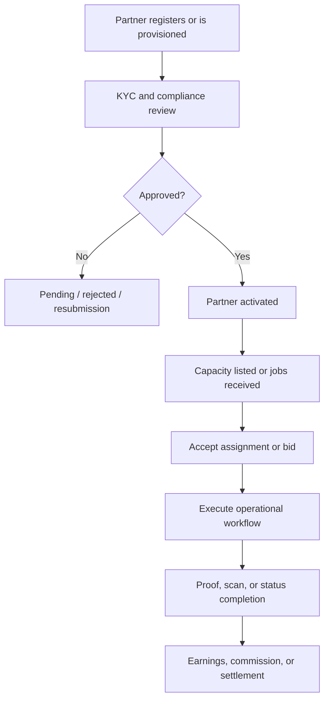

## 6. Driver Delivery Flow

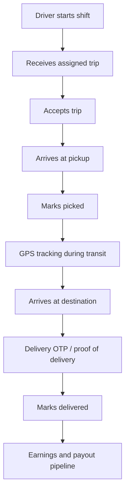

## 7. Warehouse Flow

Operational warehouse flow:

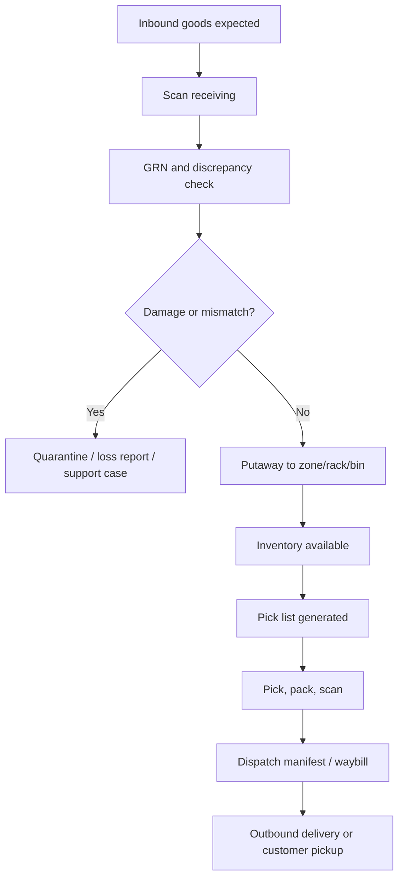

Warehouse marketplace listing and booking flow:

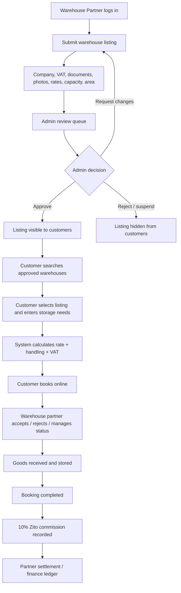

Warehouse listing business rules:

1. Warehouse partner profile approval and warehouse listing approval are separate controls.
2. A partner may list only warehouses they manage or are explicitly authorized to operate.
3. Customer discovery shows only approved listings.
4. Listings must include rates, capacity, location/area, photos, documents, company details, and VAT setup.
5. Customer booking captures storage type, goods description, dates, requested capacity, and notes.
6. Zito records 10% default commission from the warehouse partner booking value; customer screens do not show internal commission math.

## 8. Marketplace Flow

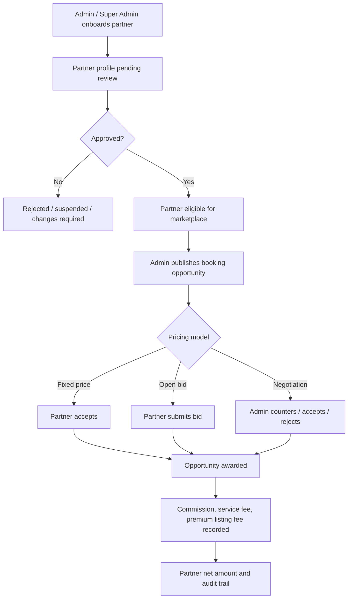

Marketplace controls:

| Control | Business Rule |
|---|---|
| Partner types | Agent, transporter, courier company, warehouse partner |
| Approval | Pending partners cannot accept or bid |
| Matching | Partner type, service area, radius, fleet/warehouse constraints |
| Pricing | Fixed price, open bid, negotiation |
| Admin actions | Publish opportunity, accept/reject/counter bids, suspend partner |
| Revenue | Commission, service fee, premium listing fee, partner net amount |

## 9. Finance Flow

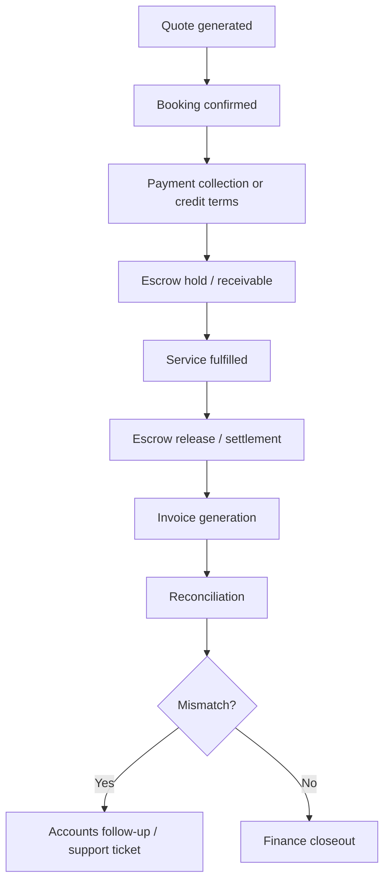

Warehouse booking commercial path:

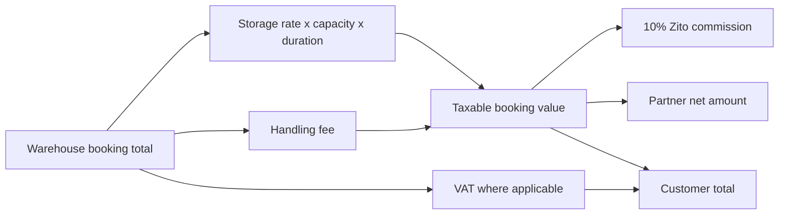

## 10. Support Flow

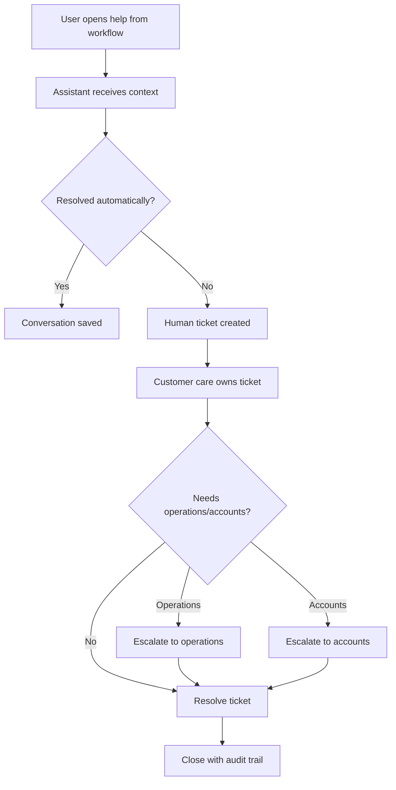

## 11. Internal Operations Flow

Internal users manage exceptions, approvals, support, compliance, and financial controls.

Daily control rhythm:

1. Review dashboard KPIs, pending approvals, and alerts.
2. Clear booking exceptions and capacity gaps.
3. Monitor SLA breaches, route deviations, and support tickets.
4. Review failed payments, refunds, and unmatched reconciliation items.
5. Approve KYC, partner activation, high-risk changes, and escalations.
6. Audit suspicious login, fraud flags, and operational overrides.

## 12. End-to-End Business Flow

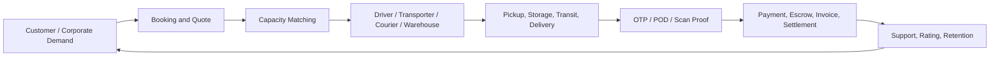

## 13. Business Controls

| Control | Purpose |
|---|---|
| OTP login | Protect account access |
| Role-based workspaces | Prevent operational and data leakage |
| KYC approval | Control supply-side trust |
| Booking state machine | Prevent invalid fulfillment steps |
| Delivery verification | Confirm goods reached recipient |
| Escrow and reconciliation | Protect money movement |
| Audit logs | Support governance and investigation |
| SLA alerts | Protect service quality |
| Support escalation | Keep customer and partner issues accountable |
| Warehouse listing review | Prevent unverified warehouses from appearing to customers |
| Marketplace approval | Prevent unapproved partners from accepting paid work |
| Commission ledger | Preserve Zito revenue and partner settlement traceability |
