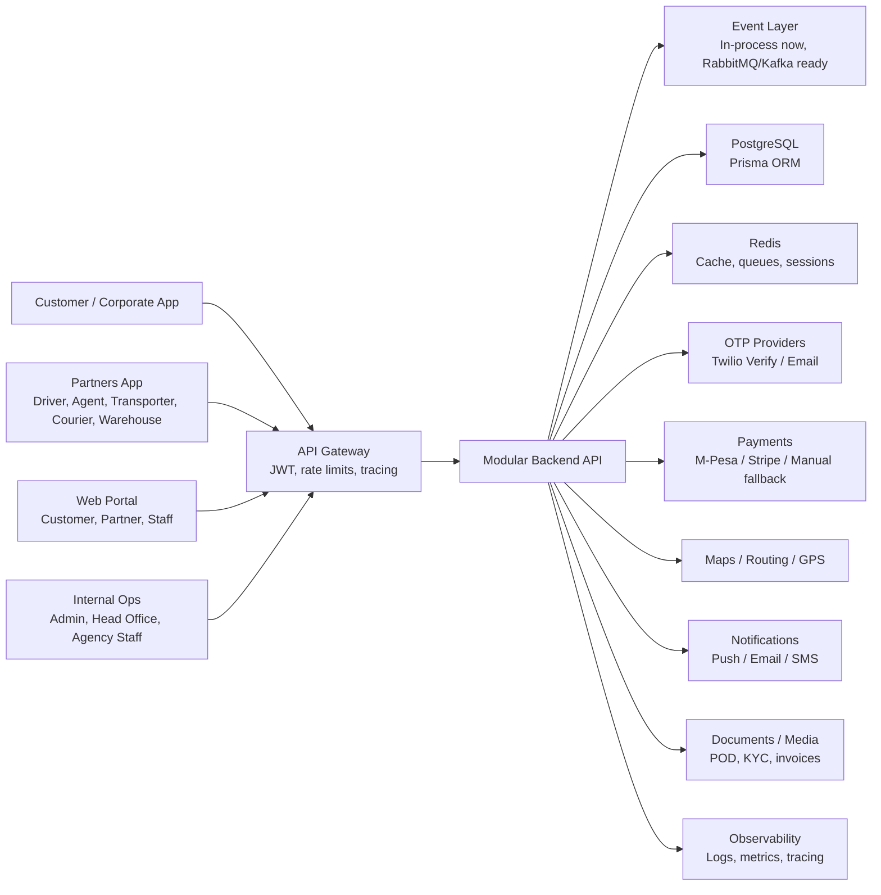
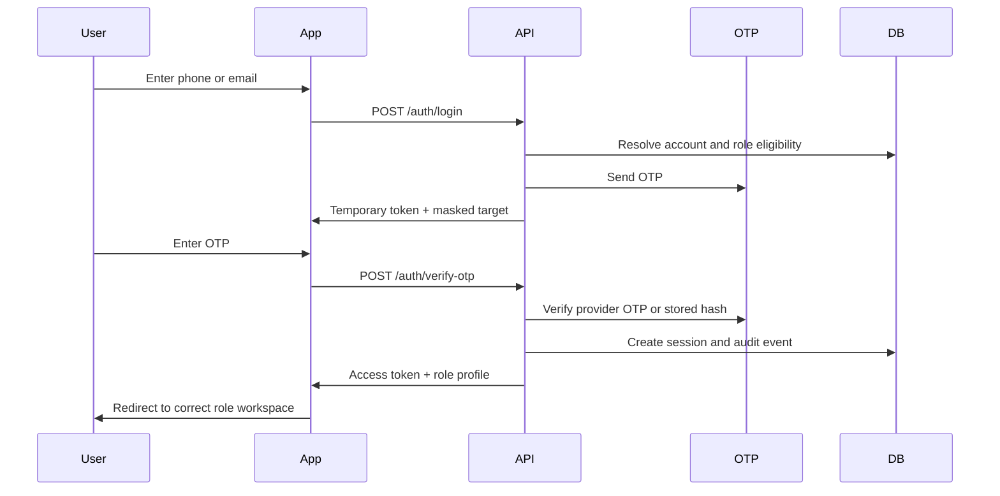
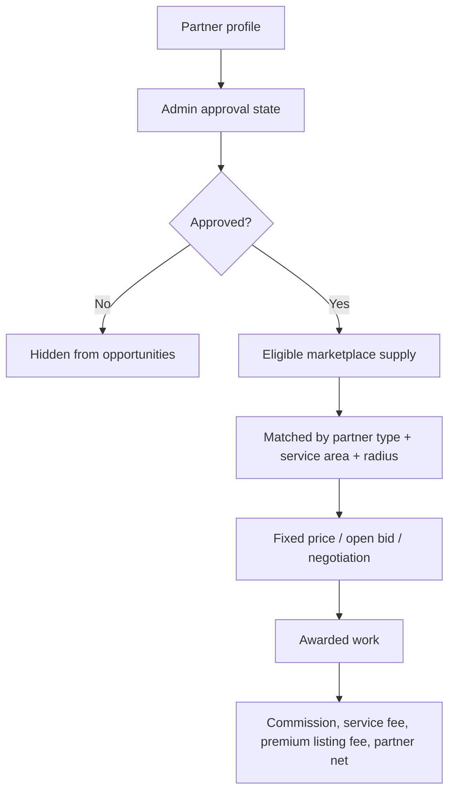
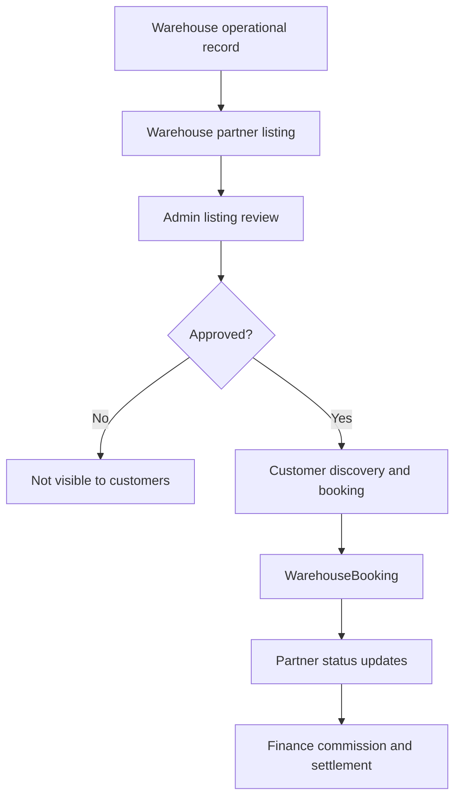

# Zito High-Level Architecture

**Source PRD:** `docs/prd/ZITO_PRD_v10_ULTIMATE.txt`  
**Scope:** Customer, partner, internal operations, unified backend, data, integrations, and operational controls.

## 1. Architecture Goal

Zito is a unified logistics platform for Africa-scale transport, courier, warehouse, fleet, marketplace, finance, and internal operations. The platform uses separate user-facing app surfaces with one shared identity, one backend API, and one transactional data model.

The PRD position is platform-first: Zito does not own trucks, warehouses, or drivers. Zito coordinates customers, corporate shippers, transporters, courier companies, warehouse partners, drivers, agents, and internal staff through controlled workflows, role-based access, and auditable state transitions.

## 2. System Context

## 3. Application Surfaces

| Surface | Primary Users | Responsibilities |
|---|---|---|
| Zito Logistics Service | Individual customers, corporate accounts | Booking, tracking, payments, invoices, support, addresses, delivery proof |
| Zito Partners | Drivers, agents, transporters, courier companies, warehouse partners | Jobs, fleet, dispatch, warehouse scans, inventory, earnings, delivery verification |
| Zito Internal Ops | Super admin, admin, head-office staff, agency staff | User provisioning, approvals, bookings control, reconciliation, support, alerts, compliance |
| Web Frontend | Admin, customer, partner, staff portals | Operational workspaces, dashboards, guides, internal/private routes |
| Unified Backend | All clients | Auth, RBAC, domain workflows, integrations, audit, persistence |

## 4. Core Backend Domains

The backend is organized as a modular monolith around PRD business domains. This is the required starting point for PRD v10: strong module boundaries first, microservice extraction later only where scale, compliance, team ownership, or deployment independence requires it.

| Domain | Module Area |
|---|---|
| Identity and access | `auth`, `users`, `staff`, `agencies`, RBAC guards |
| Booking lifecycle | `bookings`, `marketplace`, `route-optimization`, `sla` |
| Driver and fleet operations | `drivers`, `fleet`, `capacity-planning`, `heatmap` |
| Warehouse operations and listings | `warehouse`, `warehouses`, `inventory`, `scan`, `waybill`, `loss-detection` |
| Finance | `payments`, `billing`, `invoices`, `reconciliation`, `rate-cards`, `surge-pricing`, `contracts` |
| Support and notifications | `support`, `ai-support`, `notifications`, `alerts` |
| Governance | `audit`, `fraud`, `system-health`, `retention`, `rto` |
| Event platform | `events`, request context, idempotency, audit fallback |

Logical enterprise services map to these modules:

| Logical Service | Current Boundary |
|---|---|
| Identity Service | `auth`, `users`, guards, session/RBAC controls |
| Booking Service | `bookings`, booking DTOs, lifecycle services |
| Dispatch Service | `bookings`, `marketplace`, `route-optimization`, `capacity-planning` |
| Tracking Service | `tracking`, GPS updates, trip visibility |
| Fleet Service | `fleet`, `drivers` |
| Warehouse Service | `warehouse`, `inventory`, `scan`, `waybill` |
| Payment/Billing Services | `payments`, `billing`, `invoices`, `reconciliation` |
| Notification Service | `notifications`, provider channel services |
| Compliance/Audit Services | `audit`, `fraud`, KYC documents, internal alerts |
| Analytics/AI Services | `analytics`, `ai-support`, `heatmap`, `surge-pricing` |
| Marketplace Service | `marketplace`, partner approval, opportunities, bids |

## 4.1 API Surface Separation

The gateway and backend must keep API surfaces separated even when served by one NestJS application:

- Customer APIs: booking, tracking, payment, invoice, support, public warehouse listings, warehouse booking.
- Partner APIs: transporter, driver, agent, courier-company, warehouse-partner, fleet, listing, bid, payout, compliance.
- Internal Admin APIs: approvals, finance, support, audit, analytics, marketplace governance, manual overrides.
- System Event APIs: payment callbacks, notification callbacks, internal event status, future queue/webhook ingestion.

Current implementation adds request context headers (`X-Correlation-Id`, `X-Request-Id`, `X-Tenant-Id`) so this separation can be traced across the modular backend and future gateway.

## 5. Data Architecture

The primary database is PostgreSQL through Prisma. Core models include:

- `User`, `KycDocument`, `LoginOtp`, `LoginAttempt`
- `Booking`, `BookingStop`, `FreightMilestone`
- `Driver`, `DriverShift`, `DriverPayroll`, `Vehicle`
- `Warehouse`, `WarehouseZone`, `WarehouseRack`, `WarehouseBin`, `WarehouseListing`, `WarehouseBooking`, `InventoryItem`, `InventoryMovement`, `ScanEvent`
- `Payment`, `Disbursement`, `Wallet`, `WalletTransaction`, `Escrow`
- `Invoice`, `InvoiceLineItem`, `SupportTicket`, `Notification`, `AuditLog`, `FraudFlag`

Important enums include `UserRole`, `BookingStatus`, `ServiceType`, `PaymentStatus`, `PaymentMethod`, `InventoryStatus`, `WaybillStatus`, and `TicketStatus`.

High-volume data must not overload the transactional database:

- GPS history should move to TimescaleDB or partitioned time-series tables before large-scale live tracking.
- Search should move to OpenSearch/Elasticsearch for booking, invoice, waybill, container, OCR, customer, and partner search.
- Analytics should move to a separate BI warehouse such as ClickHouse or BigQuery once reporting volume grows.
- Files must remain in object storage, not database rows, with metadata in PostgreSQL.

## 5.1 Event Architecture

PRD v10 requires an event-driven foundation. The current codebase starts with an in-process event module and audit fallback, with RabbitMQ/Kafka adapter readiness.

Core event groups:

- Booking: `BookingCreated`, `BookingAssigned`, `BookingCancelled`, `BookingCompleted`
- Payment: `PaymentInitiated`, `PaymentVerified`, `EscrowReleased`, `RefundProcessed`
- Driver: `DriverOnline`, `DriverArrived`, `DriverNoShow`
- Tracking: `TripStarted`, `GPSUpdated`, `TripDelayed`, `PODUploaded`
- Warehouse: `InventoryReceived`, `InventoryMoved`, `InventoryDispatched`

Event guarantees:

- Correlation ID propagation.
- Idempotency-key de-duplication.
- Audit fallback for critical event visibility.
- Future retry queues and dead-letter queues when RabbitMQ/Kafka is enabled.
- Replayable event records for finance, compliance, disputes, and manual override evidence.

## 6. Identity and Role Segregation

Zito uses one identity model with multiple possible roles per account. The PRD requires public and internal access separation:

- Public customer surfaces must not expose internal role entry points.
- Partner surfaces must not expose admin or agency-staff flows.
- Internal roles must use private internal routes and controlled provisioning.
- API authorization must enforce role-based filtering even when UI routes are hidden.

Login is OTP-first:

## 7. Booking and Marketplace Architecture

Booking is a controlled state-machine workflow. The PRD target lifecycle is:

`CREATED -> SEARCHING -> APPROVED -> ASSIGNED -> ACCEPTED -> ARRIVED -> PICKED -> IN_TRANSIT -> ARRIVED_AT_DESTINATION -> DELIVERY_VERIFICATION -> DELIVERED -> PAYMENT_PENDING -> COMPLETED`

Branch states include `CANCELLED` and `REJECTED`.

Marketplace matching connects shipper demand to partner supply:

- Customer or corporate creates booking.
- Pricing and capacity source are calculated.
- Operations approval and marketplace publication occur where required.
- Driver, transporter, courier, warehouse, or agent capacity is assigned.
- Tracking, SLA, payment, and audit services attach to the booking.

Marketplace partner architecture:

Warehouse online booking is a parallel customer-facing marketplace flow, separated from operational warehouse storage records:

Separation rule:

- `Warehouse` remains the operational facility record for zones, racks, bins, inventory, and scan workflows.
- `WarehouseListing` is the customer-facing commercial listing with photos, documents, rates, capacity, location, VAT, and approval status.
- `WarehouseBooking` records the online customer storage booking, status lifecycle, customer total, VAT, 10% default Zito commission, and partner net amount.
- Admin listing approval is separate from warehouse-partner profile approval.
- Customer discovery can read only approved warehouse listings.

## 8. Integration Architecture

| Integration | Purpose | Failure Handling |
|---|---|---|
| Twilio Verify / SMS provider | Phone OTP delivery and verification | Return provider-availability error, never expose provider brand to end users |
| Email provider | Email OTP and password reset | Retry/fallback path and support escalation |
| M-Pesa | STK push, B2C payouts, B2B settlement | Sandbox/manual fallback during testing |
| Stripe | Card/online payment option | Provider abstraction and payment status tracking |
| Maps/routing | ETA, route optimization, tracking | Manual route fallback and cached/last-known states |
| Push/email/SMS notifications | Booking, payment, support, alert events | Queue/retry and audit delivery state |

## 9. Security and Compliance Architecture

Controls required by PRD:

- OTP validity, cooldown, resend limit, attempt limit, lockout.
- Hashed OTP storage for auth OTP.
- Delivery OTP attempt limiting.
- RBAC enforcement at API and UI levels.
- Audit logs for critical state changes.
- KYC workflows for drivers, partners, and regulated accounts.
- Internal staff provisioning separate from public registration.
- No provider names or sensitive technical internals in customer-facing errors.

## 10. Deployment View

Local defaults:

- Backend: `http://127.0.0.1:5000`
- Frontend: `http://127.0.0.1:3001`
- Swagger: `http://127.0.0.1:5000/api/docs`

Production deployment should keep database, backend, frontend, Redis/queue, storage, and provider credentials independently configurable. Environment secrets must be managed outside source control.

PRD v10 production target:

- API gateway: Kong, NGINX Gateway, or AWS API Gateway.
- Compute: Docker on ECS initially; Kubernetes only when service scale justifies it.
- Secrets: AWS Secrets Manager or Vault.
- Observability: Prometheus metrics, Grafana dashboards, Sentry error tracking, Loki/ELK logs, OpenTelemetry traces.
- Release safety: CI/CD, staging, rollback, blue-green deployment, feature flags.
- Security: WAF, DDoS mitigation, token revocation, device integrity checks, rooted-device detection where mobile risk requires it.
- Multi-tenant strategy: tenant, agency, partner, and enterprise isolation at API, RBAC, audit, invoice, analytics, and support boundaries.
