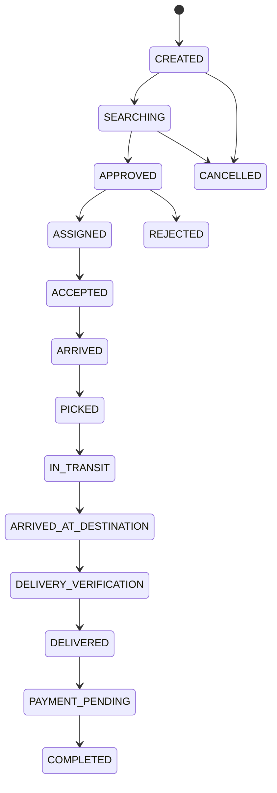
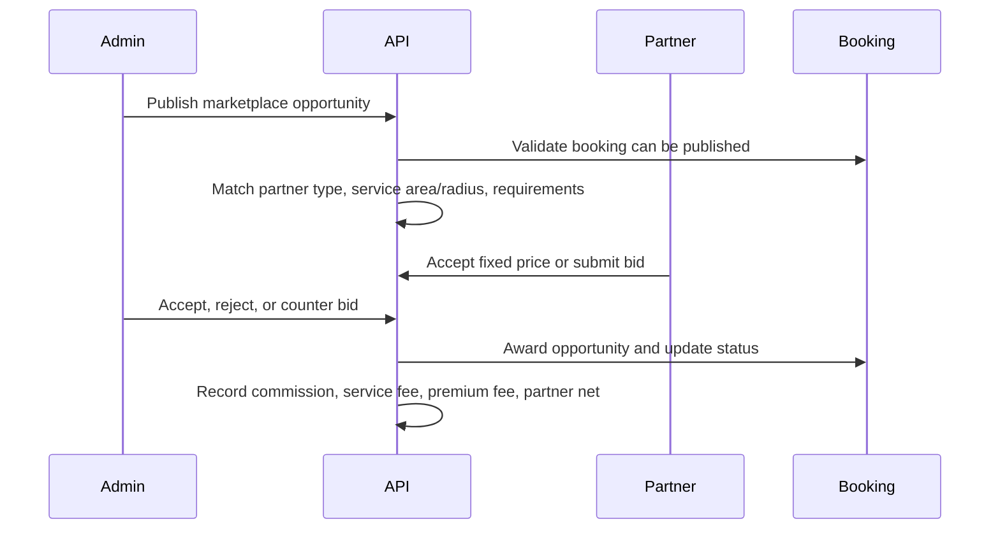

# Zito Technical Design Document

**Source PRD:** `docs/prd/ZITO_PRD_v10_ULTIMATE.txt`  
**Codebase Areas:** `backend/`, `frontend/`, `zito-mobile/`  
**Status:** Living technical design for implementation, QA, and release hardening.

## 1. Purpose

This document translates the PRD into a technical design for Zito's current platform: Expo mobile apps, web portals, NestJS backend, Prisma/PostgreSQL data model, and external logistics/payment/OTP integrations.

## 2. Design Principles

- Keep public customer, partner, and internal routes separated.
- Keep authentication OTP-first and provider-agnostic.
- Enforce role and workflow rules in the API, not only the UI.
- Treat bookings, payments, scans, and deliveries as auditable state machines.
- Design dashboards for operational density, not marketing pages.
- Hide infrastructure/provider names from customer-facing errors.
- Preserve manual fallback paths for early market launch where paid providers are not fully enabled.

## 3. Technology Stack

| Layer | Technology |
|---|---|
| Mobile | Expo, React Native, Expo Router |
| Web | Next.js app router |
| Backend | NestJS, TypeScript |
| ORM | Prisma |
| Database | PostgreSQL / Neon baseline |
| Auth | OTP-first, JWT/session token flow, RBAC |
| Payments | M-Pesa, Stripe, manual fallback |
| Notifications | SMS, email, push/in-app notifications |
| Docs/API | Swagger at backend API |

## 4. Major Components

### 4.1 Mobile App

The mobile route groups represent role surfaces:

- `(customer)` for customer and corporate booking/tracking.
- `(driver)` for driver trip, earnings, SOS, profile.
- `(agent)` for agent opportunities and marketplace participation.
- `(transporter)` for fleet, drivers, finance, bookings.
- `(courier-company)` for courier company dashboard and bookings.
- `(warehouse)` for warehouse inventory and scanning.
- `(internal)` for internal operational dashboards.
- `(auth)` for shared login and onboarding entry points.

### 4.2 Web Frontend

The web app includes public and private route groups:

- `(auth)` for public login.
- `(admin)`, `internal`, `staff` for internal operations.
- `customer`, `corporate`, `driver`, `transporter`, `warehouse`, `courier-company`, `agent`, `partners` for role-specific portals.
- `guides`, `pending-approval`, `unauthorized`, and `select-role` for support states.

### 4.3 Backend API

The backend exposes domain modules:

- `auth`: login, OTP, sessions, KYC, password reset, reauth.
- `bookings`: booking creation, state transitions, cancellation, delivery verification.
- `marketplace`: partner onboarding, approval state, opportunity publishing, bids, awards, and marketplace commission tracking.
- `tracking`: GPS and route visibility.
- `payments`: collections, disbursements, wallet/escrow.
- `warehouse`, `inventory`, `scan`, `waybill`: storage operations, warehouse listings, online warehouse bookings, and scan workflows.
- `fleet`, `drivers`: vehicles, shifts, payroll, driver operations.
- `support`, `notifications`, `ai-support`: help center and escalation.
- `audit`, `fraud`, `alerts`, `system-health`: governance and monitoring.

## 5. Authentication Design

### 5.1 Public Login

Public login starts with phone OTP or email OTP. Email users complete password entry only after email OTP verification. Phone login completes after OTP verification.

Core requirements:

- OTP input accepts full-code paste/autofill.
- Resend remains visible during cooldown.
- Provider delivery failure is shown as a service availability issue.
- Provider names are not shown to users.
- Role redirect happens only after verification.

### 5.2 Internal Login

Internal staff use private internal routes. Internal accounts are provisioned by authorized users, not public registration.

### 5.3 OTP Controls

| Control | Required Behavior |
|---|---|
| Validity | 5 minutes or configurable 2-5 minute range |
| Cooldown | 30 seconds |
| Resend max | 4 resends after first send |
| Verify attempts | 5 failed attempts before lock |
| Lockout | 15 minutes |
| Storage | Auth OTP hashed at rest |
| User messaging | Attempts remaining, cooldown, masked target |

## 6. Booking Design

### 6.1 Booking State Machine



### 6.2 Booking Types

The booking engine supports courier, PTL, FTL, urgent, warehouse-linked, trade, rail, and container workflows. Multi-stop routing and freight milestones attach to the same booking record.

### 6.3 Assignment and Capacity

Assignment may be manual, marketplace-driven, or optimization-assisted. Capacity can come from drivers, fleet owners, transporters, courier partners, warehouse partners, or agents depending on service type.

## 7. Warehouse and Scan Design

Warehouse workflows use:

- Warehouse hierarchy: warehouse, zone, rack, bin.
- Inventory item status and movement records.
- Scan events for receive, pick, pack, dispatch, delivery, and exceptions.
- Waybill and manifest generation.
- Loss/damage/discrepancy handling.

Offline scan support should queue local scans and sync idempotently when connectivity returns.

### 7.1 Warehouse Listing and Booking Design

Warehouse online booking uses separate commercial records so marketplace publishing does not mutate operational storage structure.

| Model | Purpose |
|---|---|
| `Warehouse` | Operational facility, agency, manager, zones, racks, bins, inventory |
| `WarehouseListing` | Customer-facing listing submitted by warehouse partner and reviewed by admin |
| `WarehouseBooking` | Online customer booking against an approved listing |

Warehouse listing fields:

- Managed `warehouseId` and `partnerId`.
- Company name, company email, company phone.
- VAT number, VAT applies flag, VAT rate.
- Title, description, area label, address, latitude, longitude, service radius.
- Storage types, amenities, photo URLs, document URLs.
- Total capacity, available capacity, capacity unit.
- Rate amount, rate unit, handling fee, minimum booking days.
- Status: `PENDING_REVIEW`, `APPROVED`, `REJECTED`, `CHANGES_REQUESTED`, `SUSPENDED`.
- Review note, reviewer, reviewed timestamp.

Warehouse booking fields:

- Reference, listing, customer, partner.
- Status: `REQUESTED`, `ACCEPTED`, `REJECTED`, `GOODS_RECEIVED`, `IN_STORAGE`, `READY_FOR_PICKUP`, `COMPLETED`, `CANCELLED`.
- Storage type, goods description, start date, end date.
- Capacity requested and unit.
- Base amount, handling fee, VAT amount, customer total.
- Commission rate, commission amount, partner net amount.
- Customer, partner, and admin notes plus lifecycle timestamps.

Commercial calculation:

```text
duration_days = max(minimum_booking_days, ceil(end_date - start_date))
base_amount = capacity_requested * rate_amount * duration_days
taxable_amount = base_amount + handling_fee
vat_amount = taxable_amount * vat_rate_pct when VAT applies
customer_total = taxable_amount + vat_amount
commission_amount = taxable_amount * 10%
partner_net_amount = customer_total - commission_amount
```

Access rules:

- Warehouse partners may create listings only for warehouses they manage.
- Customers and corporate users can read only approved listings.
- Customers and corporate users can create warehouse bookings only against approved listings.
- Warehouse partners can read and update only their own warehouse bookings.
- Admin and Super Admin can review listings and monitor all warehouse bookings.

Primary routes:

| Surface | Route | Responsibility |
|---|---|---|
| Customer web | `/customer/warehouse` | Search approved listings and book online |
| Warehouse partner web | `/warehouse/listings` | Submit warehouse listings for admin review |
| Warehouse partner web | `/warehouse/bookings` | Accept, reject, and update warehouse booking lifecycle |
| Admin web | `/admin/warehouse-listings` | Review listings and monitor booking commission ledger |

Primary API paths:

| Method | Path | Roles |
|---|---|---|
| `GET` | `/warehouse/listings/public` | Customer, Corporate |
| `POST` | `/warehouse/partner/listings` | Warehouse Partner |
| `GET` | `/warehouse/partner/listings` | Warehouse Partner |
| `GET` | `/warehouse/admin/listings` | Admin, Super Admin |
| `PATCH` | `/warehouse/admin/listings/:id/review` | Admin, Super Admin |
| `POST` | `/warehouse/bookings` | Customer, Corporate |
| `GET` | `/warehouse/bookings` | Customer, Corporate |
| `GET` | `/warehouse/partner/bookings` | Warehouse Partner |
| `PATCH` | `/warehouse/partner/bookings/:id/status` | Warehouse Partner |
| `GET` | `/warehouse/admin/bookings` | Admin, Super Admin |
| `PATCH` | `/warehouse/admin/bookings/:id/status` | Admin, Super Admin |

### 7.2 Marketplace Design

Marketplace mode connects approved partner supply to booking demand.

Marketplace partner profile:

- Partner type: `AGENT`, `TRANSPORTER`, `COURIER_COMPANY`, `WAREHOUSE`.
- Service areas, base latitude/longitude, optional service radius.
- Linked vehicles or linked warehouses where relevant.
- Commission rate, flat service fee, premium listing flag.
- Verification status: pending, approved, rejected, suspended.

Opportunity flow:



Marketplace controls:

- Pending, rejected, or suspended partners cannot accept or bid.
- Matching must respect partner type and service coverage.
- Transporter and courier-company matching must consider fleet requirements.
- Warehouse partner opportunity matching uses partner type, service area, and optional radius; public warehouse listing approval remains a separate customer-facing listing control.
- Awarded opportunities must be auditable and finance-visible.

## 8. Finance Design

Finance components:

- Rate card quote generation.
- Surge pricing.
- Wallet ledger.
- Escrow hold/release.
- Payment provider status reconciliation.
- Invoice generation and approval.
- Driver payout and partner settlement.
- Marketplace commission and warehouse booking commission.
- Refund/reversal handling.

Payment state must never rely only on frontend state. Provider callbacks and reconciliation jobs update backend records.

## 9. Dashboard Design

Every role dashboard should prioritize operational actions and live state:

| Role | Dashboard Must Show |
|---|---|
| Customer | Active booking, quick actions, recent bookings, spend, support |
| Driver | Assigned trip, earnings, shift, navigation, delivery OTP, SOS |
| Agent | Opportunities, bids, commissions, active loads |
| Transporter | Fleet health, driver availability, bookings, finance |
| Courier Company | Pickup/delivery queue, SLA, fleet/courier performance |
| Warehouse | Inbound/outbound scans, inventory alerts, bins, exceptions |
| Internal Ops | KPIs, exceptions, approvals, alerts, support, reconciliation |

## 10. API Design Rules

- Use DTO validation for all input.
- Use idempotency keys for booking/payment operations where duplicate submission risk exists.
- Return structured errors with user-safe messages.
- Keep provider details in logs, not user-visible responses.
- Enforce role checks in controllers/guards/services.
- Audit critical changes: auth, KYC, booking status, payment, payout, support escalation, admin actions.

## 11. Non-Functional Requirements

| Area | Requirement |
|---|---|
| Availability | Backend health endpoints and provider monitoring |
| Performance | Dashboard APIs should avoid N+1 queries and oversized payloads |
| Reliability | Retry/fallback for provider failures |
| Security | RBAC, masked identifiers, hashed secrets, no debug OTP in production |
| Observability | Logs for provider failures, state transitions, suspicious login, payment callbacks |
| Usability | Mobile screens fit small Android devices and support OTP autofill/paste |

## 12. Open Risks

- OTP provider credentials and account linkage must be validated before every test cycle.
- Public proxy environment variables can break provider calls and Expo/CLI networking.
- Delivery OTP security must remain aligned with PRD: attempt limits, lockout, and non-plain storage where implemented.
- Dashboard modernization should not alter auth or navigation contracts.
